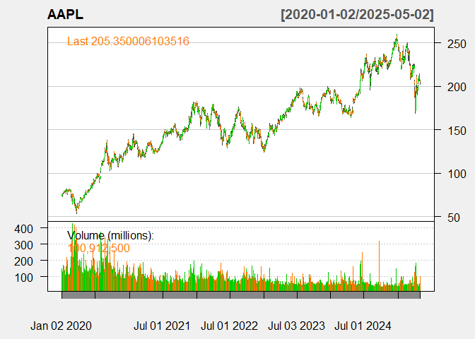
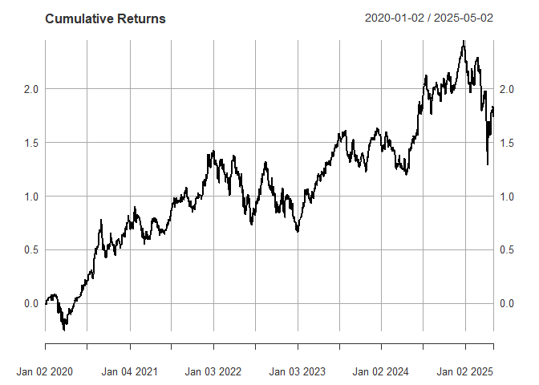
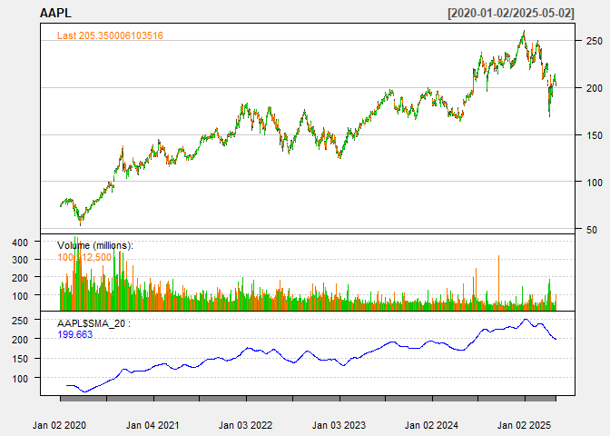
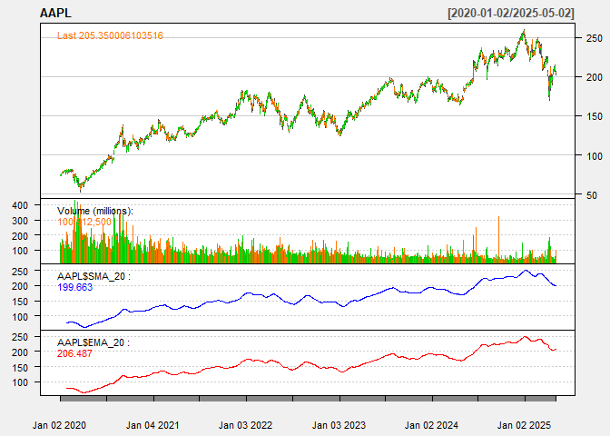
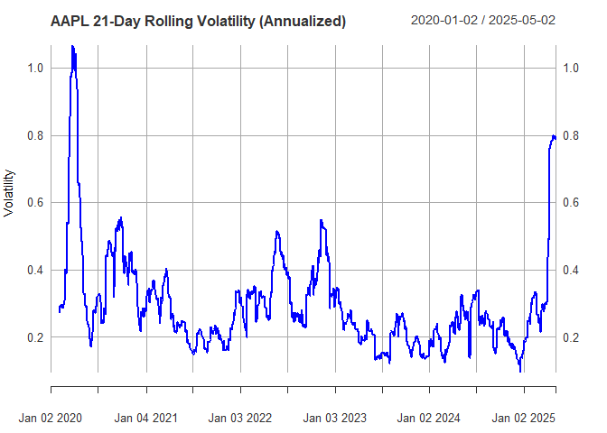
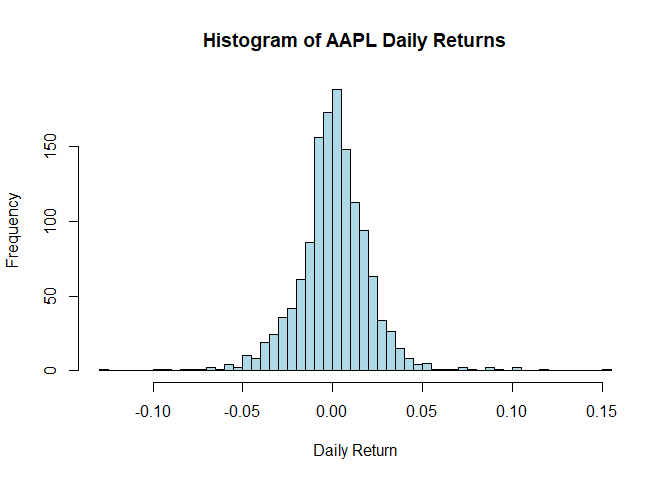
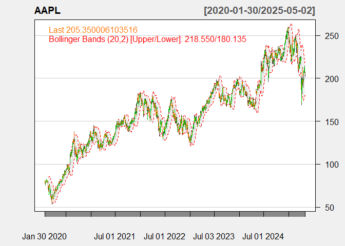

Quant Concepts
================
Henesys
2025-05-01

# Packages

``` r
library(xts)
```

    ## Loading required package: zoo

    ## 
    ## Attaching package: 'zoo'

    ## The following objects are masked from 'package:base':
    ## 
    ##     as.Date, as.Date.numeric

``` r
library(quantmod)   
```

    ## Loading required package: TTR

    ## Registered S3 method overwritten by 'quantmod':
    ##   method            from
    ##   as.zoo.data.frame zoo

``` r
library(PerformanceAnalytics)
```

    ## 
    ## Attaching package: 'PerformanceAnalytics'

    ## The following object is masked from 'package:graphics':
    ## 
    ##     legend

# Retrieval

``` r
# Retrieve Apple stock data
getSymbols("AAPL", from = "2020-01-01")
```

    ## [1] "AAPL"

``` r
# Calculate daily returns
AAPL_returns <- dailyReturn(Cl(AAPL))

# Retrieve S&P 500 index data for CAPM beta
getSymbols("^GSPC", from = "2020-01-01")
```

    ## [1] "GSPC"

``` r
GSPC_returns <- dailyReturn(Cl(GSPC))

# Align dates (in case of missing values)
returns_merged <- merge(AAPL_returns, GSPC_returns)
returns_merged <- na.omit(returns_merged)

# Visualize Apple stock price
chartSeries(AAPL, theme = "white")
```

<!-- -->

``` r
# Visualize cumulative returns
plot(cumprod(1 + AAPL_returns) - 1, main = "Cumulative Returns")
```

<!-- -->

``` r
# Basic descriptive statistics
cat("Descriptive Statistics for Apple Returns:\n")
```

    ## Descriptive Statistics for Apple Returns:

``` r
print(table.Stats(AAPL_returns))
```

    ##                 daily.returns
    ## Observations        1341.0000
    ## NAs                    0.0000
    ## Minimum               -0.1286
    ## Quartile 1            -0.0086
    ## Median                 0.0012
    ## Arithmetic Mean        0.0010
    ## Geometric Mean         0.0008
    ## Quartile 3             0.0120
    ## Maximum                0.1533
    ## SE Mean                0.0006
    ## LCL Mean (0.95)       -0.0001
    ## UCL Mean (0.95)        0.0021
    ## Variance               0.0004
    ## Stdev                  0.0206
    ## Skewness               0.2638
    ## Kurtosis               6.5701

``` r
# Risk metrics
cat("\nValue at Risk (95%):\n")
```

    ## 
    ## Value at Risk (95%):

``` r
print(VaR(AAPL_returns, p = 0.95))
```

    ##     daily.returns
    ## VaR   -0.02867654

``` r
cat("\nExpected Shortfall (95%):\n")
```

    ## 
    ## Expected Shortfall (95%):

``` r
print(ES(AAPL_returns, p = 0.95))
```

    ##    daily.returns
    ## ES   -0.03565177

``` r
# Technical indicators
AAPL$SMA_20 <- SMA(Cl(AAPL), 20)  # 20-day Simple Moving Average
AAPL$EMA_20 <- EMA(Cl(AAPL), 20)  # 20-day Exponential MA

# Plot technical indicators
addTA(AAPL$SMA_20, col = "blue")
```

<!-- -->

``` r
addTA(AAPL$EMA_20, col = "red")
```

<!-- -->

``` r
# CAPM Beta Calculation
exists("GSPC")  # TRUE
```

    ## [1] TRUE

``` r
colnames(AAPL_returns) <- "AAPL"
colnames(GSPC_returns) <- "GSPC"
returns_merged <- merge(AAPL_returns, GSPC_returns)
beta_model <- lm(AAPL ~ GSPC, data = returns_merged)
cat("\nCAPM Beta (vs S&P 500):\n")
```

    ## 
    ## CAPM Beta (vs S&P 500):

``` r
print(coef(beta_model)[2])
```

    ##     GSPC 
    ## 1.192102

``` r
# Rolling (e.g., 21-day) standard deviation of returns to visualize how volatility changes over time
# 21-day rolling volatility (annualized)
rolling_vol <- runSD(AAPL_returns, n = 21) * sqrt(252)
plot(rolling_vol, main = "AAPL 21-Day Rolling Volatility (Annualized)", col = "blue", ylab = "Volatility")
```

<!-- -->

``` r
# Bollinger Bands visualize price volatility by plotting bands two standard deviations above and below a moving average

chartSeries(AAPL, theme = chartTheme("white"), TA = "addBBands()")
```

<!-- -->

``` r
hist(AAPL_returns, breaks = 50, main = "Histogram of AAPL Daily Returns", xlab = "Daily Return", col = "lightblue")
```

<!-- -->

``` r
chartSeries(AAPL, theme = chartTheme("white"),
            TA = c("addBBands()", "addVo()", "addEMA(20)", "addEMA(10, col=2)"))
```

<!-- -->
